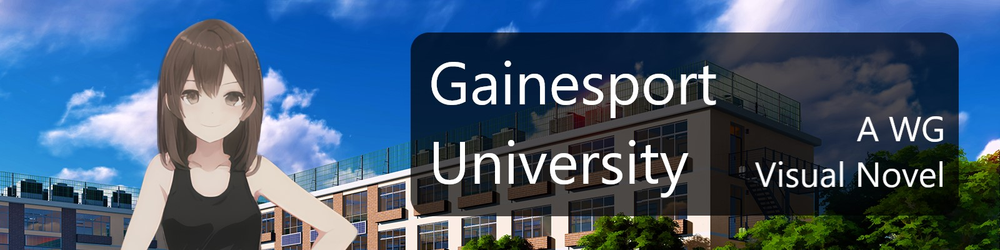
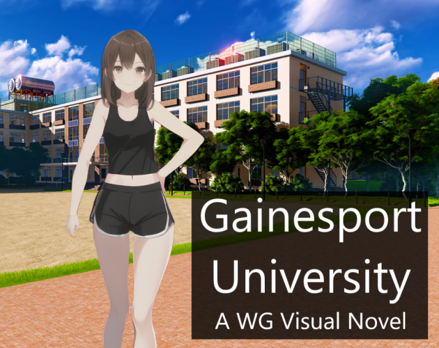

# 🎮 Gainesport University

<!-- 

<iframe frameborder="0" src="https://itch.io/embed/2144872?linkback=true" width="552" height="167"><a href="https://skynotmine.itch.io/gainesport-university">Gainesport University by SkyNotMine</a></iframe>

-->

> A weight-gain oriented visual novel currently in development, featuring AI-generated imagery and immersive storytelling set in the unique world of Gainesport University.

## 📖 About

**Gainesport University** is an interactive visual novel that combines compelling character development with innovative gameplay mechanics. Built using Ren'Py, the game features:

- 🎨 **AI-Generated Artwork** - Unique character designs and environments
- 🍳 **Interactive Mechanics** - Cooking system and character interactions
- 📚 **Rich Storytelling** - Immersive narrative with multiple character stages
- 🏫 **University Setting** - Explore the world of Gainesport University

## 🎯 Current Status

- ✅ **Tech Demo Released** - First playable version available on Itch.io
- 🔄 **In Active Development** - Regular updates and improvements
- 📈 **Growing Content** - New events, characters, and features planned

## 🚀 Features

### Current
- Multiple character progression stages
- Interactive cooking mechanics
- Character dialogue system
- Save/load functionality

### Planned
- Expanded school system
- Dating mechanics and events
- Additional characters
- Enhanced storylines

## 🎮 Play Now

**[Play the Demo on Itch.io](https://skynotmine.itch.io/gainesport-university)**

The current demo showcases core gameplay mechanics and serves as a foundation for future content updates.

## 🌐 Website

Visit the official website for more information, screenshots, and development updates:

**[skynotmine.github.io](https://skynotmine.github.io/)**

## 🛠️ Built With

- **Engine**: Ren'Py
- **Art**: AI-Generated Imagery
- **Platform**: Windows, Linux, MacOS, Android
- **Website**: HTML5, CSS3, JavaScript

## 📸 Screenshots

  

## 🤝 Contributing

This is a solo indie project, but feedback and suggestions are always welcome! Feel free to:

- Report bugs or issues
- Suggest new features
- Provide feedback on story elements
- Share your thoughts on the community forums

## 📞 Contact & Support

- **Itch.io**: [skynotmine.itch.io](https://skynotmine.itch.io/gainesport-university)
- **Website**: [skynotmine.github.io](https://skynotmine.github.io/)

## 📄 License

All rights reserved. This project and its assets are the intellectual property of SkyNotMine.

---

  <b>🎯 Support the development of Gainesport University!</b> 
  <a href="https://skynotmine.itch.io/gainesport-university">Play Demo</a> • 
  <a href="https://skynotmine.github.io/">Visit Website</a>

---

*Created with ❤️ by SkyNotMine*